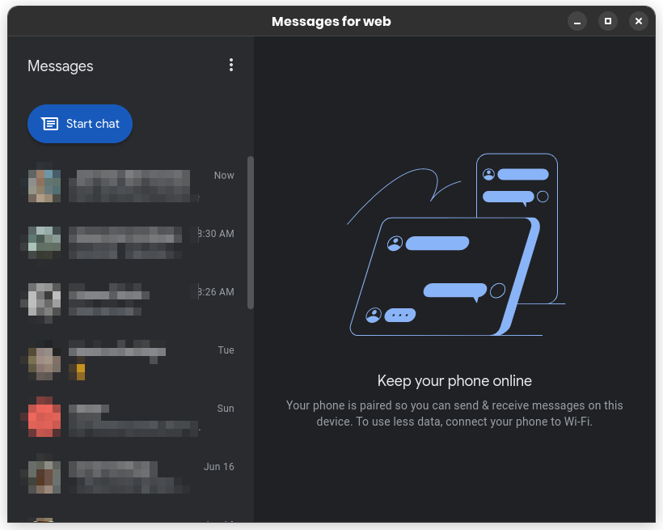
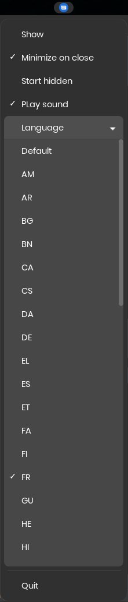

# Google Messages Electron

Electron version of [Google Messages for the web](https://messages.google.com/web/conversations)

# Features

- Change tray icon to red when a message is received
- Play a sound when a message is received (optional)
- Start hidden (optional)
- Minimize on close (optional)
- Select language for the app & the spell checking 

### Screenshots




# Build

```
$ npm install
$ npm run dist
```

# Install (linux)

```
$ npm run linux:install
```

This will install the app in `~/.local/google-messages-electron` 
- create a link `~/.local/bin/google-messages-electron`
- install a .desktop file `~/.local/share/applications/google-messages-electron.desktop`

### Flatpak

Flatpak is partially supported (but not yet recommended) :

```
$ npm install
$ npm run flatpack:build
$ npm run flatpack:run
```

__

Inspired by : https://github.com/ankurk91/google-chat-electron
